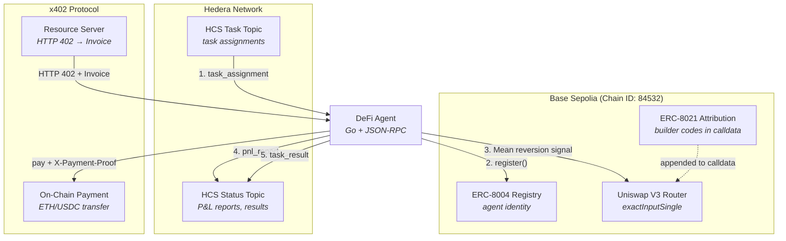

# agent-defi

Autonomous DeFi trading agent for Base Sepolia with on-chain identity, machine-to-machine payments, and transaction attribution.

Part of the [ETHDenver 2026 Agent Economy](../README.md) submission.

## Overview

A self-sustaining trading agent that operates on Base Sepolia (chain ID 84532). It registers an on-chain identity via ERC-8004, pays for external services autonomously via the x402 payment protocol, executes mean reversion trades on Uniswap V3, and attributes all transactions with ERC-8021 builder codes. P&L reports and health status are published to the coordinator via Hedera Consensus Service (HCS).

The agent is designed to be economically self-sustaining: trading revenue covers gas costs, compute fees (paid via x402), and HCS messaging costs.

## Built with Obedience Corp

This project is part of an [Obedience Corp](https://obediencecorp.com) campaign -- built and planned using **camp** (campaign management) and **fest** (festival methodology). This repository, its git history, and the planning artifacts in `festivals/` are a live example of these tools in action.

## Architecture



### Trading Pipeline

Each trading cycle follows this sequence:

| Step | Component | Action |
|------|-----------|--------|
| 1. Market Data | `TradeExecutor.GetMarketState()` | Fetch price and moving average from DEX/oracle |
| 2. Signal | `MeanReversionStrategy.Evaluate()` | Compare price deviation against buy/sell thresholds |
| 3. Execute | `TradeExecutor.Execute()` | ABI-encode Uniswap V3 `exactInputSingle`, apply ERC-8021 attribution |
| 4. Record | `PnLTracker.Record()` | Track trade result, calculate running P&L |
| 5. Report | `HCS.PublishPnLReport()` | Broadcast P&L to coordinator via HCS |

### Concurrent Goroutines

The agent runs three concurrent loops under a shared context:

- **Trading loop**: Evaluates strategy and executes trades at `DEFI_TRADING_INTERVAL` (default: 60s)
- **P&L reporting**: Publishes cumulative P&L via HCS at `DEFI_PNL_REPORT_INTERVAL` (default: 5min)
- **Health heartbeat**: Broadcasts agent liveness at `DEFI_HEALTH_INTERVAL` (default: 30s)

## Base Protocol Integration

### ERC-8004: On-Chain Agent Identity

The agent registers a verifiable on-chain identity before trading:

- **Contract**: ERC-8004 registry deployed on Base Sepolia
- **Registration**: `register(bytes32 agentID, bytes pubKey, bytes metadata)`
- **Verification**: `getIdentity(bytes32 agentID)` returns the full identity record
- **Purpose**: Enables other agents and contracts to verify this agent's identity and provenance

### x402: Machine-to-Machine Payments

The agent autonomously handles payment-gated resources:

1. Agent requests a resource (e.g., market data API, compute service)
2. Server responds with **HTTP 402 Payment Required** + `PaymentEnvelope` JSON body
3. Agent parses the invoice, validates amount and expiry
4. Agent checks gas price against safety limit (`MaxGasPrice`)
5. Agent submits on-chain payment to Base Sepolia
6. Agent retries the request with `X-Payment-Proof` and `X-Payment-TxHash` headers
7. Server verifies payment on-chain and grants access

This enables fully autonomous resource acquisition without human intervention.

### ERC-8021: Builder Attribution

Every trade transaction includes an ERC-8021 builder code:

- **Format**: `[original calldata] [4-byte magic marker] [20-byte builder code]`
- **Adds 24 bytes** to calldata
- **Transparent**: All attributed transactions are identifiable on-chain
- **Purpose**: Tracks which builder/agent generated the transaction for analytics and revenue sharing

### Uniswap V3: Trade Execution

Trades are executed against the Uniswap V3 `SwapRouter` on Base Sepolia:

- **Function**: `exactInputSingle((address,address,uint24,address,uint256,uint256,uint160))`
- **Selector**: `0x414bf389`
- **Fee tier**: 3000 (0.3%)
- **Default pair**: USDC (`0x036CbD...7e`) → WETH (`0x4200...06`)
- **Slippage**: Configurable via `SlippageBPS` (default: 50 = 0.5%)

### Mean Reversion Strategy

The trading strategy operates on a simple principle: prices tend to revert to their historical mean.

| Parameter | Default | Description |
|-----------|---------|-------------|
| `BuyThreshold` | 2% | Buy when price is this far below the moving average |
| `SellThreshold` | 2% | Sell when price is this far above the moving average |
| `DataStalenessLimit` | 5min | Reject market data older than this |
| `MinLiquidity` | configurable | Minimum DEX liquidity to trade |
| `MaxPositionSize` | configurable | Cap on individual trade size |

Signal confidence scales linearly with deviation magnitude (0.5 at threshold, 1.0 at 2x threshold). Position size scales proportionally with confidence.

## P&L Summary

The agent's economic model targets **~$12-16 net profit per trade** at the 2% mean reversion threshold with a $1000 position:

| Component | Amount |
|-----------|--------|
| Revenue (2% deviation) | $20.00 |
| Uniswap fee (0.3%) | -$3.00 |
| Gas (Base L2) | -$0.01 |
| Slippage (est.) | -$1-5 |
| **Net per trade** | **~$12-16** |

Base L2 gas costs are negligible (~$0.01 per `exactInputSingle` call), making the self-sustaining model viable even at conservative trading thresholds. The `IsSelfSustaining` flag in every HCS P&L report is computed as `NetPnL > 0`.

For full economic analysis, break-even math, and verification steps, see [docs/pnl-proof.md](docs/pnl-proof.md).

## Quick Start

```bash
cp .env.example .env   # fill in values below
just build
just run
```

## Prerequisites

- Go 1.24+
- Hedera testnet account ([portal.hedera.com](https://portal.hedera.com))
- Base Sepolia ETH (for gas) and USDC (for trading)
- Base Sepolia RPC endpoint (default: `https://sepolia.base.org`)

## Configuration

### Agent Core

| Variable | Default | Description |
|----------|---------|-------------|
| `DEFI_AGENT_ID` | (required) | Unique agent identifier |
| `DEFI_TRADING_INTERVAL` | `60s` | How often to evaluate and trade |
| `DEFI_PNL_REPORT_INTERVAL` | `5m` | How often to publish P&L reports |
| `DEFI_HEALTH_INTERVAL` | `30s` | Heartbeat cadence |

### Base Chain

| Variable | Default | Description |
|----------|---------|-------------|
| `DEFI_BASE_RPC_URL` | `https://sepolia.base.org` | Base Sepolia JSON-RPC endpoint |
| `DEFI_WALLET_ADDRESS` | (required) | Agent's Ethereum address |
| `DEFI_PRIVATE_KEY` | (required) | Hex-encoded private key for signing |
| `DEFI_DEX_ROUTER` | | Uniswap V3 SwapRouter address |
| `DEFI_TOKEN_IN` | `0x036CbD...7e` | Token to sell (USDC on Base Sepolia) |
| `DEFI_TOKEN_OUT` | `0x4200...06` | Token to buy (WETH on Base Sepolia) |

### Protocol Integration

| Variable | Description |
|----------|-------------|
| `DEFI_ERC8004_CONTRACT` | ERC-8004 identity registry contract address |
| `DEFI_BUILDER_CODE` | 20-byte ERC-8021 builder code (hex) |
| `DEFI_ATTRIBUTION_ENABLED` | Enable ERC-8021 attribution (default: true) |

### Hedera Transport

| Variable | Description |
|----------|-------------|
| `HEDERA_ACCOUNT_ID` | Hedera testnet account (0.0.xxx) |
| `HEDERA_PRIVATE_KEY` | Hedera private key |
| `HCS_TASK_TOPIC` | Topic ID for receiving task assignments |
| `HCS_RESULT_TOPIC` | Topic ID for publishing results and P&L |

## Project Structure

```
cmd/agent-defi/            Entry point, dependency wiring
internal/
  agent/                   Agent lifecycle, config, goroutine orchestration
  base/
    attribution/           ERC-8021 builder code encoder/decoder
    identity/              ERC-8004 on-chain identity registration
    payment/               x402 machine-to-machine payment protocol
    trading/               Mean reversion strategy, trade executor, P&L tracker
  guard/                   CRE Risk Router constraint enforcement (position clamping)
  hcs/                     HCS publish/subscribe transport (Hiero SDK)
```

## Development

```bash
just build      # Build binary to bin/
just run        # Run the agent
just test       # Run unit tests
just lint       # golangci-lint
just fmt        # gofmt
just clean      # Remove build artifacts
```

## CRE Risk Router Integration

The agent enforces position constraints from the [CRE Risk Router](../cre-risk-router/) via `internal/guard/CREGuard`:

- If the coordinator provides a CRE-approved `MaxPositionUSD`, the guard clamps the requested trade size to that limit
- If no CRE constraint is present, the agent falls back to its local strategy limits
- All constraint decisions are logged for audit

This ensures the DeFi agent can never exceed the position size approved by the Chainlink DON consensus risk evaluation.

## Base Bounty Alignment

This project targets the **Base: Self-Sustaining Agent** bounty.

| Requirement | Implementation |
|-------------|----------------|
| Self-sustaining agent | Trading revenue covers gas costs, compute fees (x402), and HCS messaging |
| On-chain identity | ERC-8004 agent identity registered on Base Sepolia |
| Machine-to-machine payments | x402 protocol: HTTP 402 handshake with on-chain payment proof |
| Transaction attribution | ERC-8021 builder codes appended to all trade calldata |
| DeFi trading | Mean reversion strategy on Uniswap V3 (USDC/WETH) |
| Provable P&L | Trading results tracked per-trade with tx hashes; P&L reports published to Hedera HCS |
| Base Sepolia deployment | All on-chain operations target chain ID 84532 |

### ERC Standards Used

| Standard | Purpose | Package |
|----------|---------|---------|
| ERC-8004 | Agent identity registration | `internal/base/identity/` |
| ERC-8021 | Builder attribution codes | `internal/base/attribution/` |
| x402 | Machine-to-machine payment protocol | `internal/base/payment/` |

## License

MIT
